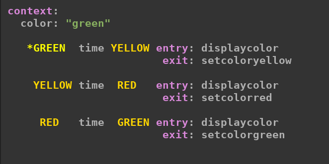
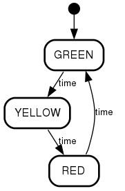
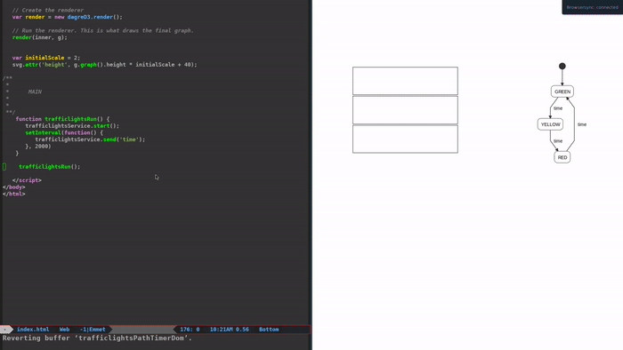

# simple-machine-config-xstate
> A simple dsl (?) to write machine configurations for xstate

> 🚧 Still Work in progress 🚧 


According to the  [xstate](https://github.com/davidkpiano/xstate) documentation  a  machine config is the same as the state node config with the addition of some properties, a state node:

> ... specifies a state configuration. They are defined on the machine's states property. Likewise, sub-state nodes are hierarchically defined on the states property of a state node.

The idea of this project is to write a simplified version of an xstate machine config.


- Example of xstate machine config:


``` javascript
let trafficlight = {
   initial: "GREEN",
    context: {
       color:"green"},
    states: {
       GREEN: {
	      entry: ['displaycolor'],
	       exit: ['setcoloryellow'],
          on: {
	   time: {
	    target: "YELLOW"
	    }
         }
       },
      YELLOW: {
          entry: ['displaycolor'],
	       exit: ['setcolorred'],
       on: {
        time: {
	  target: "RED"
	    }
        }
      },
      RED: {
          entry: ['displaycolor'],
	       exit: ['setcolorgreen'],
        on: {
	 time: {
	   target: "GREEN"
	 } 
	 }
    }
  }
};
```

- Using this project:


  - Code:



  - Graph (png): 





### Initial Configuration

 Download an example from the `examples/browser/` folder or just use the scripts:


- xstate.js        ([from the original repo](https://github.com/davidkpiano/xstate) )
- d3.v5.min.js     ([from the original repo](https://github.com/d3/d3/wiki))
- dagre-d3.min.js  ([from the original repo](https://github.com/dagrejs/dagre-d3/wiki))
- grammarDagreD3.js (from the ./statecharts folder)
- grammarXstate.js  (from the ./statecharts folder)


### Executable statecharts/diagram

  Using [xstate](https://github.com/davidkpiano/xstate) and [dagre-d3]( https://github.com/dagrejs/dagre-d3) is possible to create an executable diagram:





> In addition to just using statecharts to model the behaviour in documents separate from the actual running code, it’s possible to use one of various machine formats, both to design the behaviour, and at run-time to actually be the behaviour. The idea is to have a single source of truth that describes the behaviour of a component, and that this single source drives both the actual run-time code, but that it can also be used to generate a precise diagram that visualises the statechart.[[0]](https://statecharts.github.io/)


# State transtion table 

 The description of the state machine/statecharts used in this project follow the idea of a `state transition table` with  this format:
 
``` javascript
  STATE input STATE  <function> 
```

> In automata theory and sequential logic, a state-transition table is a table showing what state (or states in the case of a nondeterministic finite automaton) a finite-state machine will move to, based on the current state and other inputs. It is essentially a truth table in which the inputs include the current state along with other inputs, and the outputs include the next state along with other outputs. 


[State transition table](https://en.wikipedia.org/wiki/State-transition_table)


# Demo/Example

[Calculator](https://diegoperezm.github.io/simple-machine-config-xstate/examples/browser/calculator/calcbasicoperations/index.html)


